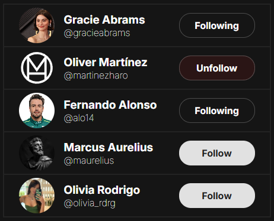

# X Follow

A simple "Who to follow" interaction component inspired by X (formerly Twitter), built with vanilla HTML, CSS, and JavaScript.

## Live Demo

You can see the live demo of the project here:  
**[x-follow.pages.dev](https://x-follow.pages.dev)**

## Features

- Dynamic rendering of user profiles.
- Interactive follow/unfollow button states.
- Clean and modern UI using the Inter font family.

## Technologies Used

- HTML5
- CSS3 (Vanilla)
- JavaScript (ES6+)

## License

This project is licensed under the MIT License. See the [LICENSE](./LICENSE) file for details.
